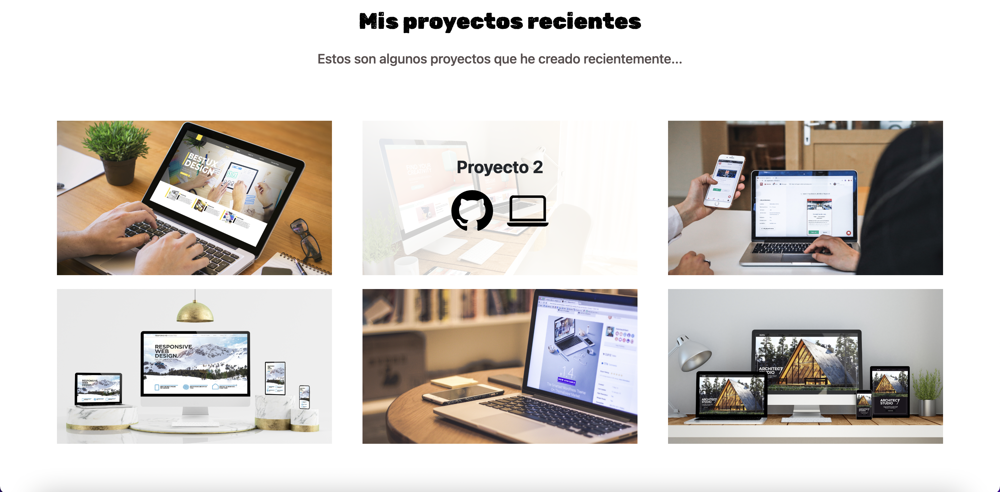

# Portafolio-personal-NEO
Portafolio personal
# Portafolio Adaptable (Responsive) con Bootstrap 5

Este proyecto fue creado para el bootcamp Tecnolochicas PRO, es una página web adaptable a dispositivos de distintos tamaños (este tipo de sitio web se conoce en inglés como "responsive"). 

El propósito de esta página web es mostrar el portafolio de mis proyectos y la experiencia que hasta ahora he podido ganar en Tecnolochicas. A continuaci[on se cluye una descripción breve de mi motivación, experiencia, proyectos, intereses y formas de contacto. 
He podido personalizar esta página que incluye una foto de perfil de mí (la desarrolladora), también se conservo la animación a la escritura de la página web con JavaScript.

### Capturas de pantalla:

Primera parte de la página web:

![Primera parte de la página web]

Experiencia:

Proyectos:

Testimonios:

Contacto:

## Tecnologías

Esta página web fue creada con:

* HTML
* CSS
* JavaScript 
* Bootstrap 5

Además, se incluyeron **Google Fonts** para personalizar la fuente y **Bootstrap icons** para incorporar íconos como flechas y logos de redes sociales populares. 

## Español

El texto de la página web está escrito en español, al igual que las clases y atributos personalizados. Las clases relacionadas con Bootstrap se incluyeron en inglés.
